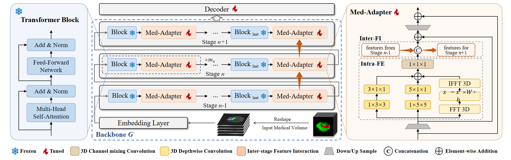

# Med-Tuning: A New Parameter-Efficient Tuning Framework for Medical Volumetric Segmentation
This is a PyTorch official implementation of paper [Med-Tuning: A New Parameter-Efficient Tuning Framework for Medical Volumetric Segmentation](https://arxiv.org/abs/2304.10880). Our paper has been accepted by Medical Imaging with Deep Learning 2024 (MIDL2024).

## Overview
The ``pre-training then fine-tuning (FT)" paradigm is widely adopted to boost the model performance of deep learning-based methods for medical volumetric segmentation. However, conventional full FT incurs high computational and memory costs. Thus, it is of increasing importance to fine-tune pre-trained models for medical volumetric segmentation tasks in a both effective and parameter-efficient manner. In this paper, we introduce a new framework named Med-Tuning to realize parameter-efficient tuning (PET) for medical volumetric segmentation task and an efficient plug-and-play module named Med-Adapter for task-specific feature extraction. With a small number of tuned parameters, our framework enhances the 2D baselines's precision on segmentation tasks, which are pre-trained on natural images. Extensive experiments on three benchmark datasets (CT and MRI modalities) show that our method achieves better results than previous PET methods on volumetric segmentation tasks. Compared to full FT, Med-Tuning reduces the fine-tuned model parameters by up to 4x, with even better segmentation performance. **Our project webpage is at this URL.**



## Requirements
Basic requirements:
- Ubuntu 20.04.1
- CUDA version==11.2
- Python==3.8

You need to run the following commands to create a new environment.
```
conda create -n medt python==3.8
conda activate medt
cd ../Med-Tuning-main
pip install requirements.txt
```

## Data Preparation
Download the BraTS2019 datasets and organize them:
```python
- Datasets
    - BraTS2019
        - Train # Official train set, 335 samples
            - HGG
                - BraTS19_xx0
                    - BraTS19_xx0_t2.nii.gz
                    - BraTS19_xx0_t1ce.nii.gz
                    - BraTS19_xx0_t1.nii.gz
                    - BraTS19_xx0_seg.nii.gz
                    - BraTS19_xx0_flair.nii.gz
                    - BraTS19_xx0_data_f32b0.pkl
                - BraTS19_xx1
                ...
                
            - LGG
                - BraTS19_xx0
                    - BraTS19_xx0_t2.nii.gz
                    - BraTS19_xx0_t1ce.nii.gz
                    - BraTS19_xx0_t1.nii.gz
                    - BraTS19_xx0_seg.nii.gz
                    - BraTS19_xx0_flair.nii.gz
                    - BraTS19_xx0_data_f32b0.pkl
                - BraTS19_xx1
                ...

            - train.txt # Contains all official train samples. Each line is is a relative path of one sample dir, eg. HGG/BraTS19_xx0
            - train_0.txt
            - train_1.txt
            - train_2.txt
            - train_3.txt
            - train_4.txt # Contains 4/5 official train samples for 5-fold training.
            - valid_0.txt
            - valid_1.txt
            - valid_2.txt
            - valid_3.txt
            - valid_4.txt # Contains 1/5 official train samples for 5-fold validation.
        - Test # Official test set, 125 samples
            - BraTS19_xx0
                - BraTS19_xx0_t2.nii.gz
                - BraTS19_xx0_t1ce.nii.gz
                - BraTS19_xx0_t1.nii.gz
                - BraTS19_xx0_flair.nii.gz
                - BraTS19_xx0_data_f32b0.pkl
            - BraTS19_xx1
            ...
            - valid.txt # Contains all official test samples. Each line is is a relative path of one sample dir, eg. BraTS19_xx0
```

## Preparation
Run the following commands to download the supervised pre-trained checkpoint of Swin-T and ViT-B/16.
```
cd ../Med-Tuning-main/preckpt/
wget https://storage.googleapis.com/vit_models/imagenet21k/ViT-B_16.npz
wget https://github.com/SwinTransformer/storage/releases/download/v1.0.0/swin_tiny_patch4_window7_224.pth
```
Then change the corresponding path in `configs/config.py`.

## Finetuning
First change the args you may need in <train.sh>,  then run  `sh train.sh` in terminal. 


## Testing
First change the args you may need in <test_fold_3D.sh>,  then run  `sh test_fold_3D.sh` in terminal.

## Notice
Currently, we support CUDA version. 

You can use one gpu or more than two gpus, just change `CUDA_VISIBLE_DEVICES` and `nproc_per_node`.


## Citation
If our paper or code inspire your researches, please cite us by
```text
@inproceedings{shen2024medtuning,
  title={Med-Tuning: A New Parameter-Efficient Tuning Framework for Medical Volumetric Segmentation},
  author={Jiachen Shen and Wenxuan Wang and Chen Chen and Jianbo Jiao and Jing Liu and Yan Zhang and Shanshan Song and Jiangyun Li},
  booktitle={Medical Imaging with Deep Learning},
  year={2024},
  url={https://openreview.net/pdf?id=5D71lHj9HZ}
}
```

## Acknowledgement
Thanks for the code from [Swin-Unet](https://github.com/HuCaoFighting/Swin-Unet), [timm](https://github.com/huggingface/pytorch-image-models).
